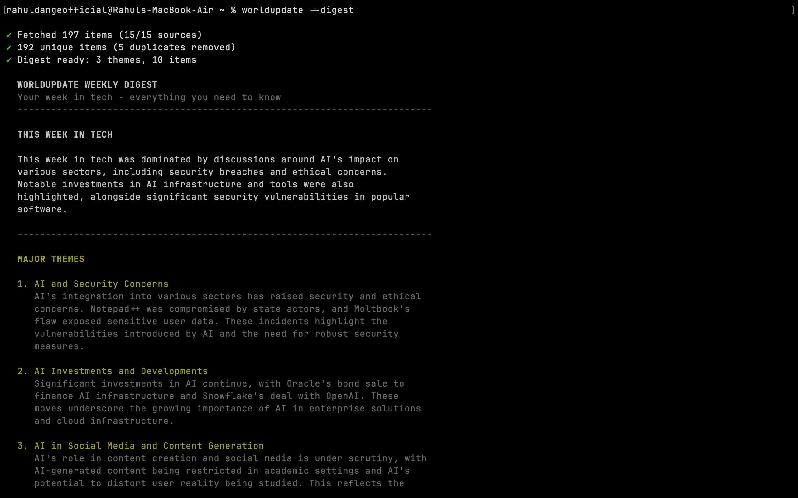
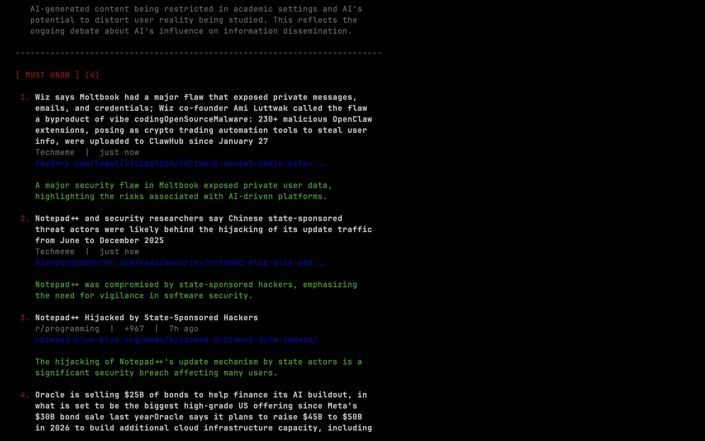
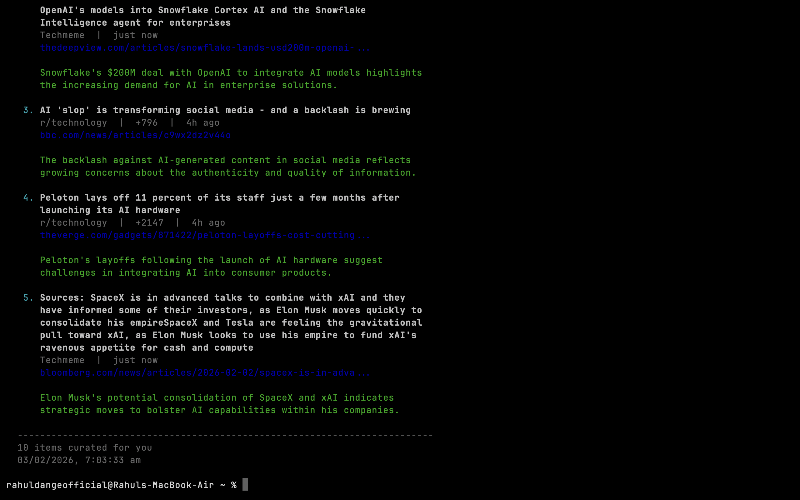

# worldupdate

A CLI tool that crawls 20+ tech news sources and uses AI to surface what actually matters.



## Features

- **20+ Sources**: Hacker News, Reddit, Lobsters, GitHub, The Hacker News, Krebs, and more
- **AI-Powered Filtering**: GPT-4o analyzes and ranks news by real impact
- **Weekly Digest Mode**: Themes, summaries, and must-know items for weekly check-ins
- **Opportunity Detection**: Highlights deals, free tiers, and limited-time offers
- **Clean Terminal UI**: Works consistently across all terminals

## Installation

```bash
git clone https://github.com/rahuldangeofficial/worldupdate.git
cd worldupdate
./install.sh
```

## Setup

```bash
# Add your OpenAI API key
echo "OPENAI_API_KEY=sk-your-key-here" > ~/.worldupdate.env
```

## Usage

```bash
# Daily filtered news
worldupdate

# Weekly digest with themes and must-know items
worldupdate --digest

# More options
worldupdate --limit 25
worldupdate --category security
worldupdate --category ai
worldupdate --raw              # skip AI
worldupdate --list-sources
```



## How It Works

1. **Fetch**: Crawls 20+ sources in parallel with retry logic
2. **Deduplicate**: Removes duplicate stories across sources
3. **Analyze**: GPT-4o filters for genuine impact (not just trending)
4. **Display**: Groups by CRITICAL, IMPORTANT, OPPORTUNITY, NOTABLE

### Digest Mode

Perfect for weekly check-ins:
- **THIS WEEK IN TECH**: 2-3 sentence overview
- **MAJOR THEMES**: Recurring topics grouped together
- **MUST KNOW**: Essential items even if you read nothing else
- **OPPORTUNITY**: Deals, free tiers, discounts



## Sources

| Category | Sources |
|----------|---------|
| Tech | Hacker News, Lobsters, Slashdot, Techmeme |
| Reddit | r/programming, r/technology, r/netsec, r/MachineLearning, r/devops, r/golang, r/rust, r/javascript |
| Developer | DEV.to, Hashnode, DZone |
| GitHub | Trending, Blog |
| Security | The Hacker News, Krebs on Security, Ars Technica |
| AI/ML | Papers With Code |
| Product | Product Hunt |

## Requirements

- Node.js 18+
- OpenAI API key

## License

MIT
